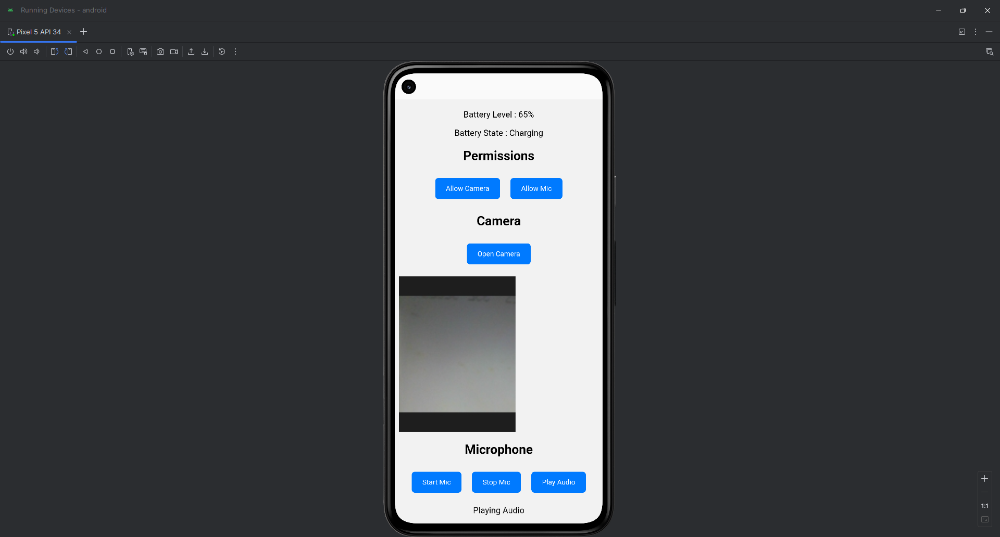

# Capacitor Demo App

## 📌 Description
This project demonstrates mobile features using Capacitor plugins. Developed as part of my internship.

## 🚀 Features
- Battery Level & Status
- Camera & Microphone Permission
- Capture & Preview
- Audio Recording & Playback
- Kiosk Mode

## 🛠️ Tech Stack
- Capacitor
- HTML, CSS, JavaScript

## ▶️ How to Run
1. npm install
2. npx cap sync
3. npx cap open android

## 📸 Screenshots

## 🙋‍♂️ Author
Balamithra
